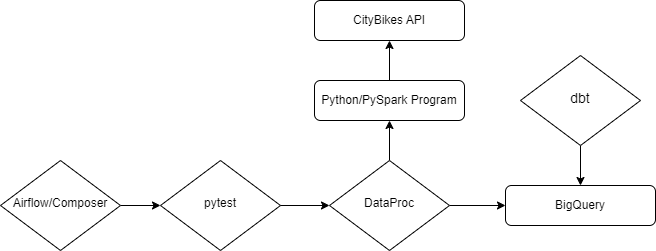

# Introduction

This project provides instructions for how to create an end-to-end data engineering pipeline to collect, process, and analyze real-time data from the Taipei YouBike system using GCP services. 
The data used for this project, and data for city-wide bike systems around the world, is available thanks to the CityBikes API at https://api.citybik.es/v2/networks.
The pipeline uses Pyspark for data processing, BigQuery for storage, DataProc for running Spark jobs, Cloud Composer/Airflow for orchestration, and dbt for transformations.

# Prerequisites

Python 3.8+
Spark 
GCP account
dbt

# Architecture
Two tables are used to store the data.
The dimension table has the information about each individual station with columns station_id, longitude, latitude, name, district, and address.
The fact table has the updated status of the bike with columns station_id, timestamp, free_bikes, and empty_slots.

The data is processed in the following steps:
1. Ingestion: Data is pulled from the CityBikes API using a Python task in Airflow. The data is processed with PySpark and saved into BigQuery
2. Processing: The PySpark job is submitted to Google Cloud Dataproc.
3. Orchestration: Airflow (Cloud Composer) will orchestrate the entire workflow. The DAG will be scheduled to run every 15 minutes between 8 PM and 8 AM.
4. Transformation: dbt transforms and queries the data for analysis.

# Testing
To run all tests in the Python code, just enter 'pytest'
To run an individual test do 'pytest test_main.py::test_fetch_bike_data'

To run all dbt tests, enter 'dbt test'
To run one dbt test, do 'dbt test --select average-usage'

# Setup
Make sure the requirements file has all the packages you need. Install them with:
pip3 install -r requirements.txt
Note: Make sure to use 'pip3' in gcloud or you might just install the dependencies for Python2 by mistake!

Set the project. I named mine "taipei-bike-data-project".
gcloud config set project taipei-bike-data-project

Put the files from this repo into your GCP file system or just checkout the repo in GCP.

Enable these APIs now before you move on. They might take a few minutes to be available:
BigQuery API
Cloud Dataproc API
Cloud Composer

Create a bucket and put your files in there.
gsutil mb gs://taipei-bike-bucket/
gsutil cp main.py gs://taipei-bike-bucket/

Create your dataproc cluster (min size is now 30gb)

gcloud dataproc clusters create my-cluster \
    --region=us-central1 \
    --single-node \
    --master-machine-type=n1-standard-2 \
    --master-boot-disk-size=30GB \
    --image-version=2.0-debian10 \
    --project=taipei-bike-data-project

Run Spark job with needed dependency

gcloud dataproc jobs submit pyspark gs://taipei-bike-bucket/main.py \
    --cluster=my-cluster \
    --region=us-central1 \
    --jars=gs://spark-lib/bigquery/spark-bigquery-with-dependencies_2.12-0.30.0.jar \
    --project=taipei-bike-dataproject

Setup Cloud Composer

gcloud composer environments create taipei-bike-env \
    --location us-central1 \
    --zone us-central1-a \
    --machine-type n1-standard-2 \
    --node-count 3 \
    --disk-size 100 \
    --python-version 3 \
    --image-version composer-2.0.25-airflow-2.3.3

Add the requirements from the requirements.txt folder to Cloud Composer.

To run the dbt models:
dbt init taipei-bike-project
dbt run

# dbt Models

1. average_usage.sql aggregates data on bike usage per station. It calculates the average percentage of empty slots (bike usage) for each station and ranks stations based on their average usage over time.
2. bike_change.sql calculates the average change in the number of free bikes at each station between updates. It ranks stations by how much their availability fluctuates, providing insights into stations with high or low variability in bike availability.
3. district_std_dev.sql calculates the standard deviation of bike and slot availability for each district, allowing you to identify which districts have more stable or more variable bike-sharing services.
4. closest_stations.sql find the closest stations to the best restaurant in the world, Din Tai Fung, using geolocation data.

# Manual Run-through

Put the pyspark program and requirements in your bucket

Start the cloud composer DAG

Query your dimension and fact table in BigQuery

Run your dbt models and check out the results.

Highest average changes in available bikes  

Lowest percent bike usage  

Busiest stations (by standard deviation)  

Closest stations to Din Tai Fung (geospatial query)  

